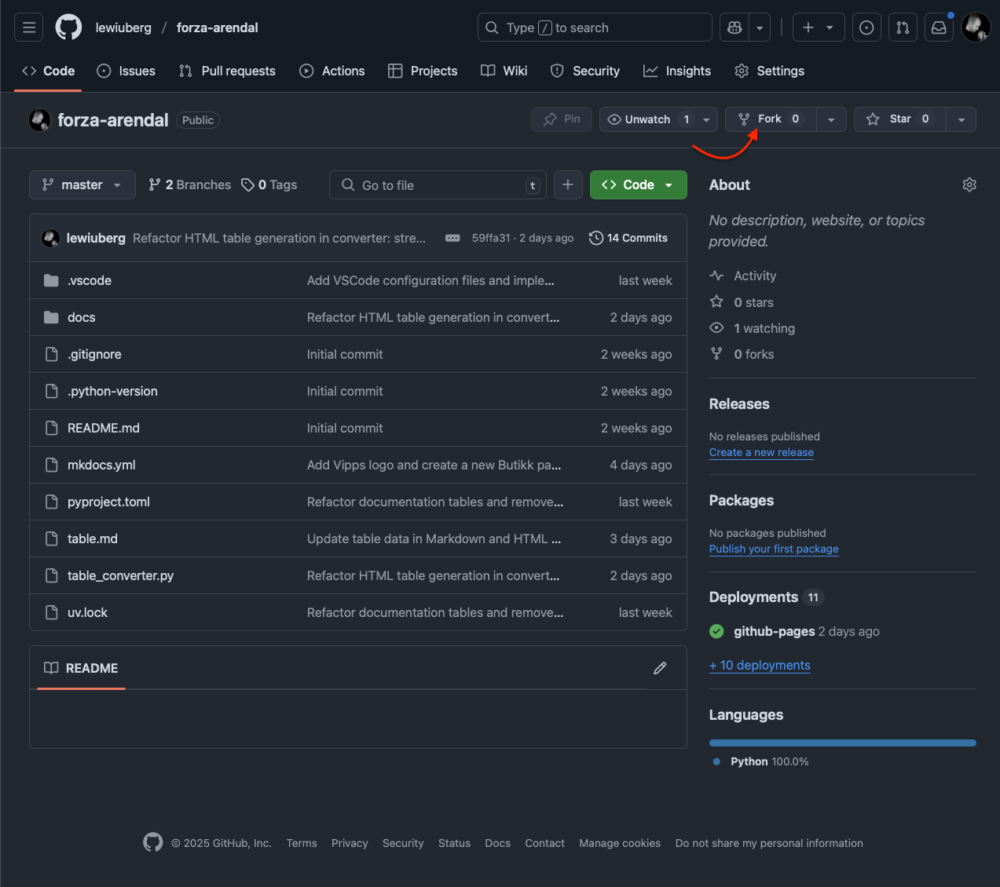
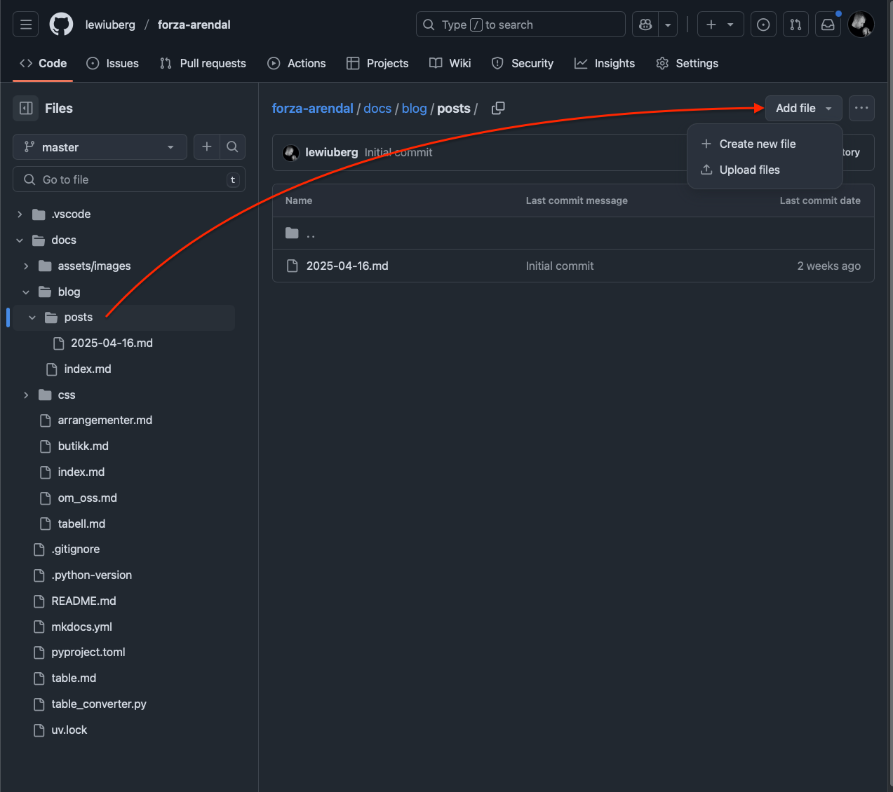

---
date:
  created: 2025-04-30
  # updated: 2025-04-16
draft: false
# pin: false
# links:
#   - index.md
#   - blog/index.md
#   - Homepage: index.md
#   - Blog index: blog/index.md
#   - External links:
#       - Material documentation: https://squidfunk.github.io/mkdocs-material
---

# Hvordan skrive en nyhetsmelding

For å skrive en nyhetsmelding må du skrive melingen i Markdown-formatet. Du kan bruke en hvilken som helst tekstbehandler, men filtypen må være `.md`. Du vil også trenge en konto på [GitHub](https://github.com), evt sende dette til Lewi manuelt.

## Github

For å legge til en ny nyhetsmelding i prosjektet, må du først opprette din egen "fork" av prosjektet. Dette kan du gjøre ved å klikke på "Fork" knappen øverst til høyre på prosjektets GitHub-side. Se bilde under:

<!--  -->



Deretter, i din egen fork kan du legge til en ny fil i `docs/blog/posts/`-mappen. Filnavnet må være i formatet `YYYY-MM-DD.md`, der `YYYY` er året, `MM` er måneden og `DD` er dagen for når nyhetsmeldingen ble skrevet. For eksempel, hvis du skriver en nyhetsmelding den 30. april 2025, kan du navngi filen `2025-04-30.md`.



## Format

Dette prosjektet bruker [Markdown](https://www.markdownguide.org/) for å formatere tekst. Markdown er et lettvekts markeringsspråk som lar deg skrive tekst med enkel syntaks. Prosjektet bruker også [Material for MkDocs](https://squidfunk.github.io/mkdocs-material/) som er et tema for MkDocs, et verktøy for å lage dokumentasjon med Markdown. Material for MkDocs har sin egen [dokumentasjon](https://squidfunk.github.io/mkdocs-material/getting-started/) som kan være nyttig å lese.

### Eksempler

#### Overskrift

```md linenums="1" title="2025-05-01.md"
# Overskrift 1

Det må være en overskrift 1 i nyhetsmeldingen. Det må også være en tom linje for å skille overskriften fra innholdet.
Dette er den største overskriften og brukes til å indikere hovedtemaet for meldingen.

## Overskrift 2

Dette er en underoverskrift som brukes til å dele opp innholdet i nyhetsmeldingen.
Du kan ha flere nivåer av overskrifter, avhengig av hvor mye informasjon du vil inkludere.

### Overskrift 3

Osv osv.
```

!!! Example "Resultat"

    # Overskrift 1

    Det må være en overskrift 1 i nyhetsmeldingen. Det må også være en tom linje for å skille overskriften fra innholdet.
    Dette er den største overskriften og brukes til å indikere hovedtemaet for meldingen.

    ## Overskrift 2

    Dette er en underoverskrift som brukes til å dele opp innholdet i nyhetsmeldingen.
    Du kan ha flere nivåer av overskrifter, avhengig av hvor mye informasjon du vil inkludere.

    ### Overskrift 3

    Osv osv.

#### Tekstformatering

```md linenums="1" title="2025-05-01.md"
For fet skrift kan du bruke **to stjerner** eller **to understreker** på hver side av teksten.

For kursiv skrift kan du bruke _en stjerne_ eller _en understrek_ på hver side av teksten.

For gjennomstreking kan du bruke ~~to tilde~~ på hver side av teksten.
```

!!! Example "Resultat"

    For fet skrift kan du bruke **to stjerner** eller __to understreker__ på hver side av teksten.

    For kursiv skrift kan du bruke *en stjerne* eller _en understrek_ på hver side av teksten.

    For gjennomstreking kan du bruke ~~to tilde~~ på hver side av teksten.
