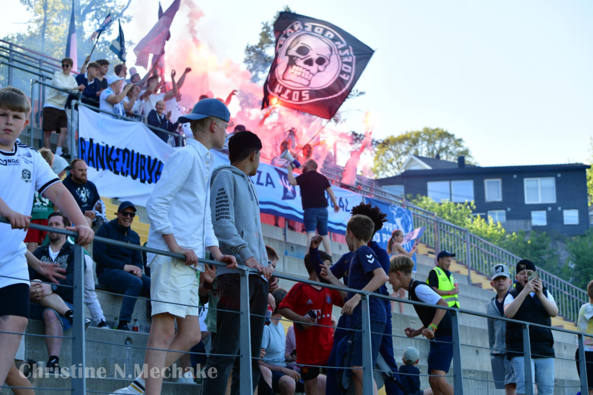

# Velkommen til Forza Arendal

Forza Arendal er supporter klubben for Arendal Fotball. Her finner du informasjon om klubben, supporterklubben og hvordan du kan bli med i fellesskapet vårt.

???+ forza "Advarsel"

    Denne nettsiden er under utvikling og vil bli oppdatert jevnlig. Vi jobber med å forbedre innholdet og legge til flere funksjoner. Hvis du har spørsmål eller tilbakemeldinger, vennligst ta kontakt med oss.

<iframe width="100%" height="100" scrolling="no" frameborder="no" allow="autoplay" src="https://w.soundcloud.com/player/?url=https%3A//api.soundcloud.com/tracks/2061375208&color=%23ff5500&auto_play=false&hide_related=false&show_comments=true&show_user=true&show_reposts=false&show_teaser=true&visual=true"></iframe>
<a href="https://soundcloud.com/lewiuberg" title="lewiuberg" target="_blank" style="color: #cccccc; text-decoration: none;">lewiuberg</a> · <a href="https://soundcloud.com/lewiuberg/alt-for-myra-vi-gir-alt-mp3" title="Alt for Myra, vi gir alt.mp3" target="_blank" style="color: #cccccc; text-decoration: none;">Alt for Myra, vi gir alt.mp3</a>

&nbsp;&nbsp;&nbsp;&nbsp;&nbsp;&nbsp;

  

    <button onclick="prevImage()" style="background-color: #002445; color: #ffffff; border: none; padding: 10px 20px; margin-right: 5px; cursor: pointer; border-radius: 10px;">Forrige</button>
    <button id="toggle-slideshow-button" onclick="toggleSlideshow()" style="background-color: #8c8e95; color: #002445; border: 1px solid #8c8e95; padding: 10px 20px; margin: 0 5px; cursor: pointer; border-radius: 10px;">Stopp</button>
    <button onclick="nextImage()" style="background-color: #002445; color: #ffffff; border: none; padding: 10px 20px; margin-left: 5px; cursor: pointer; border-radius: 10px;">Neste</button>
  

  

